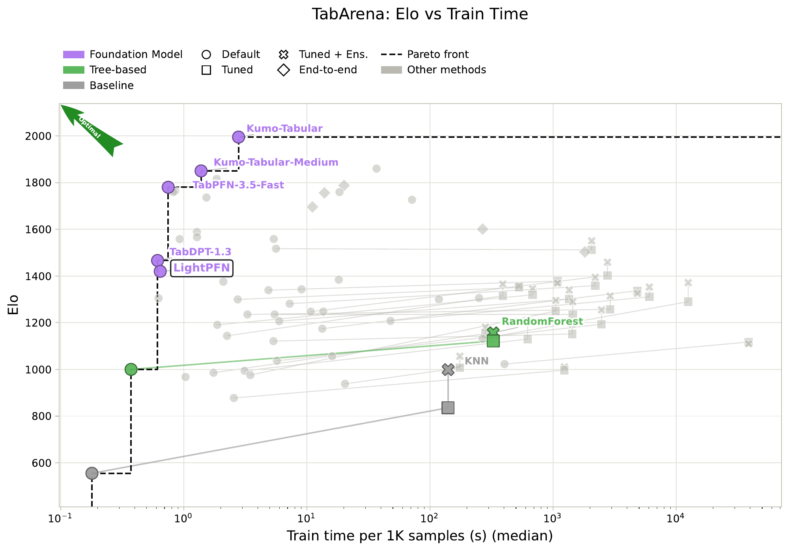

# Risultati

[English](../en/RESULTS.md) · **Italiano**

I protocolli sono descritti nel [report tecnico](../../paper/LightPFN_report.pdf) (in inglese). Le tabelle
riportano risultati del report e dei CSV collegati. La sezione ufficiale TabArena-Lite include baseline di
default, ottimizzate e in ensemble; gli altri confronti usano baseline di default. Le differenze di AUC sono in punti (100 volte la differenza di AUC),
con intervalli bootstrap appaiati al 95% su task o dataset. Il modello rilasciato è il checkpoint a contesto lungo
(LC39k nel report).

- [Insiemi di valutazione](#insiemi-di-valutazione)
- [Tabelle piccole: 55 dataset OpenML esterni a TabArena](#tabelle-piccole-55-dataset-openml-esterni-a-tabarena)
- [TabArena, pipeline ufficiale](#tabarena-pipeline-ufficiale)
- [TabArena, 38 task di classificazione con il nostro harness](#tabarena-38-task-di-classificazione-con-il-nostro-harness)
- [Tabelle più grandi](#tabelle-più-grandi)
- [Costo](#costo)
- [Feature categoriche: cosa non ha funzionato](#feature-categoriche-cosa-non-ha-funzionato)

## Insiemi di valutazione

Le scelte di progetto sono state prese su tre insiemi tenuti separati da TabArena: D1, 1.536 problemi sintetici
tenuti da parte; D2, sonde sui meccanismi (XOR, parità, tabelle di lookup tra colonne di rumore); D3, 55 dataset di
classificazione OpenML-CC18 che non sono in TabArena. TabArena è stato guardato solo per i due finalisti, dopo la
scelta tra i due.

## Tabelle piccole: 55 dataset OpenML esterni a TabArena

Al massimo 1.000 righe e 100 feature casuali per dataset, cross-validation stratificata a cinque fold, un estimatore.

| Modello | AUC media | LightPFN meno modello | LightPFN più alto su |
|---|---:|---:|---:|
| **LightPFN** | **0,9109** | | |
| CatBoost | 0,9023 | +0,86 [0,42, 1,40] | 80% dei dataset |
| Random forest | 0,8933 | +1,76 [1,03, 2,62] | 91% |
| LightGBM | 0,8907 | +2,02 [1,14, 3,16] | 91% |
| XGBoost, 54 dataset | 0,8889 | +2,06 [1,32, 2,94] | 94% |

Il wrapper categorico di XGBoost fallisce su un dataset (*sick*), escluso da entrambi i lati del confronto. Il
vantaggio su CatBoost vale sia sui dataset binari (+0,80) sia sui multiclasse (+0,92), con intervalli sopra zero.

[CSV dei confronti D3](../assets/d3_baselines.csv), inclusi intervalli bootstrap e percentuali di vittorie.

## TabArena, pipeline ufficiale

Run degli autori dell'8 ottobre 2026 con `TabArenaV0pt1ExperimentBundle(models=[("LightPFN", 0)])` e
`subset=["lite", "classification"]`: primo split ufficiale di ciascuno dei 38 dataset di classificazione,
bagging a otto fold, protocollo di validazione ufficiale `8x1`. Configurazione di default, quattro estimatori,
un checkpoint e nessuno spazio HPO. La cache del contesto è disattivata nei fold e attiva nel refit. Tutti i
38 task sono riusciti, nessuno è imputato. I 13 dataset di regressione sono esclusi.

**25° su 99 metodi, Elo 1420 (+67 / -66)**; rank medio 38,37, rank armonico 17,37, score 0,270.
Il 25° posto è la posizione ordinata per Elo; il rank medio è una metrica distinta calcolata sui dataset.

| Metodo | Elo | IC 95% |
|---|---:|---:|
| Kumo-Tabular (default) | 1995 | +163 / -119 |
| LimiX-2 (default) | 1860 | +169 / -109 |
| Mitra-v2 (default) | 1727 | +134 / -95 |
| TabPFN-2.6 (default) | 1559 | +60 / -53 |
| TabICLv2 (default) | 1558 | +77 / -68 |
| TabDPT-1.3 (default) | 1467 | +78 / -54 |
| RealMLP (tuned + ensembled) | 1459 | +50 / -47 |
| **LightPFN (default)** | **1420** | **+67 / -66** |
| RealMLP (tuned) | 1403 | +54 / -57 |
| CatBoost (tuned) | 1378 | +58 / -55 |
| CatBoost (tuned + ensembled) | 1370 | +58 / -48 |
| LightGBM (tuned + ensembled) | 1365 | +52 / -42 |
| XGBoost (tuned + ensembled) | 1346 | +58 / -62 |
| TabICL (default) [5.26% imputed] | 1343 | +72 / -65 |
| CatBoost (default) | 1339 | +49 / -52 |
| XGBoost (default) | 1191 | +57 / -69 |
| LightGBM (tuned) | 1316 | +52 / -47 |
| XGBoost (tuned) | 1320 | +64 / -62 |
| LightGBM (default) | 1144 | +59 / -63 |
| RealMLP (default) | 1247 | +64 / -53 |
| RandomForest (default) | 1000 | +71 / -84 |

L'Elo stimato supera tutti i GBDT del confronto, anche ottimizzati e in ensemble. Gli intervalli con CatBoost
tuned (1378, +58 / -55) si sovrappongono: non dimostrano una vittoria netta. TabICLv2 e i modelli fondazionali
maggiori restano avanti. TabICL v1 ha il 5,26% di risultati imputati; LightPFN non ne ha.

Hardware LightPFN: Intel i7-13700KF (16 core, 24 thread), 32 GB RAM, AMD RX 7900 XT 20 GB, Linux,
ROCm 7.2, PyTorch 2.13.0, Python 3.12.15. Fit mediano 0,65 s e predizione mediana 0,086 s per 1.000 righe.
Solo TabDPT-1.3 riporta un fit più rapido tra i metodi con Elo almeno pari; i tempi delle baseline sono quelli
pubblicati da TabArena su hardware diverso, quindi non è un confronto di velocità controllato.

[CSV della classifica](../assets/tabarena_lite_leaderboard.csv), [script e risultati completi (ZIP)](https://github.com/GioOtto/LightPFN/releases/download/v1.0.0/LightPFN-1.0.0-tabarena-lite.zip).
Lo script importa `torch` prima di AutoGluon per far rilevare la GPU AMD tramite ROCm. I maintainer TabArena
rieseguono il benchmark completo sul loro hardware prima dell'inclusione in classifica; questa posizione
Lite non è un risultato finale verificato dai maintainer.

## TabArena, 38 task di classificazione con il nostro harness

I 38 task di classificazione di TabArena v0.1, split ufficiali OpenML, prima ripetizione (114 split). È il nostro
harness, non il protocollo della classifica ufficiale (che fa bagging, ottimizza i modelli e ordina per Elo); i 13
task di regressione non sono valutati. L'errore è 1 - AUC per i task binari e la log loss per i multiclasse, come in
TabArena; i rank sono calcolati sull'errore.

| Modello | AUC media | Rank medio su 7 | Errore minore di CatBoost |
|---|---:|---:|---:|
| TabICLv2 (28M parametri, GPU) | 0,8637 | 1,58 | 87% |
| **LightPFN, 4 estimatori** | **0,8581** | **2,50** | **76%** |
| LightPFN, 1 estimatore | 0,8568 | 3,37 | 68% |
| CatBoost | 0,8553 | 3,50 | |
| LightGBM | 0,8440 | 5,34 | 5% |
| Random forest | 0,8383 | 5,89 | 3% |
| XGBoost | 0,8332 | 5,82 | 11% |

La differenza di AUC media da CatBoost è +0,28 punti [-0,26, 0,80]: LightPFN vince più task, ma la differenza media
non è significativa. TabICLv2 è avanti di 0,56 punti [0,25, 0,98].

Per gruppo (LightPFN con 4 estimatori contro CatBoost):

| Gruppo | Task | Rank medio, LightPFN / CatBoost / TabICLv2 | Punti di AUC rispetto a CatBoost | Task vinti |
|---|---:|---|---:|---:|
| binari | 30 | 2,60 / 3,30 / 1,57 | +0,25 | 70% |
| multiclasse | 8 | 2,13 / 4,25 / 1,63 | +0,38 | 100% |
| meno di 2.500 righe | 12 | 2,25 / 4,25 / 1,42 | +1,18 | 100% |
| da 2.500 a 10.000 righe | 10 | 2,70 / 3,20 / 1,80 | +0,28 | 60% |
| 10.000 righe o più | 16 | 2,56 / 3,13 / 1,56 | -0,40 | 69% |
| classe minoritaria dall'1 al 10% | 11 | 2,55 / 2,91 / 1,82 | -0,35 | 64% |

Le perdite maggiori sono su tabelle soprattutto categoriche: *in_vehicle_coupon_recommendation* (-4,49 punti),
*Amazon_employee_access* (-3,95) e *Diabetes130US* (-2,35).

AUC media per task (in grassetto il migliore), ordinati per LightPFN meno CatBoost

| Task | Righe di training | Feature | Classi | LightPFN x4 | CatBoost | TabICLv2 | LightGBM | XGBoost | RF |
|---|---:|---:|---:|---:|---:|---:|---:|---:|---:|
| jm1 | 7,257 | 21 | 2 | **0.7781** | 0.7421 | 0.7777 | 0.7385 | 0.7170 | 0.7505 |
| seismic-bumps | 1,723 | 15 | 2 | 0.7819 | 0.7501 | **0.7867** | 0.7267 | 0.7094 | 0.7301 |
| Marketing_Campaign | 1,494 | 25 | 2 | 0.9236 | 0.8936 | **0.9291** | 0.8912 | 0.7668 | 0.8878 |
| coil2000_insurance_policies | 6,548 | 85 | 2 | 0.7708 | 0.7444 | **0.7709** | 0.7299 | 0.7120 | 0.6913 |
| blood-transfusion-service-center | 499 | 4 | 2 | 0.7454 | 0.7199 | **0.7522** | 0.6774 | 0.6610 | 0.6767 |
| hazelnut-spread-contaminant-detection | 1,600 | 30 | 2 | 0.9882 | 0.9700 | **0.9942** | 0.9699 | 0.9720 | 0.9548 |
| MIC | 1,133 | 111 | 8 | 0.8669 | 0.8514 | **0.8768** | 0.8472 | 0.8476 | 0.8376 |
| Is-this-a-good-customer | 1,149 | 13 | 2 | 0.7465 | 0.7352 | **0.7497** | 0.6948 | 0.7036 | 0.7188 |
| maternal_health_risk | 676 | 6 | 3 | 0.9596 | 0.9494 | **0.9615** | 0.9463 | 0.9530 | 0.9483 |
| qsar-biodeg | 703 | 41 | 2 | **0.9435** | 0.9349 | 0.9430 | 0.9284 | 0.9279 | 0.9328 |
| Fitness_Club | 1,000 | 6 | 2 | 0.8220 | 0.8135 | **0.8220** | 0.7808 | 0.7710 | 0.7890 |
| students_dropout_and_academic_success | 2,950 | 36 | 3 | 0.8973 | 0.8891 | **0.9006** | 0.8873 | 0.8814 | 0.8810 |
| credit_card_clients_default | 20,000 | 23 | 2 | 0.7890 | 0.7819 | **0.7910** | 0.7792 | 0.7599 | 0.7621 |
| taiwanese_bankruptcy_prediction | 4,546 | 94 | 2 | **0.9441** | 0.9373 | 0.9434 | 0.9360 | 0.9302 | 0.9165 |
| heloc | 6,973 | 23 | 2 | 0.8015 | 0.7950 | **0.8022** | 0.7878 | 0.7712 | 0.7900 |
| Bank_Customer_Churn | 6,667 | 10 | 2 | 0.8714 | 0.8666 | **0.8732** | 0.8581 | 0.8386 | 0.8508 |
| credit-g | 667 | 20 | 2 | 0.7855 | 0.7809 | **0.7928** | 0.7734 | 0.7664 | 0.7651 |
| website_phishing | 902 | 9 | 3 | **0.9802** | 0.9757 | 0.9801 | 0.9756 | 0.9741 | 0.9717 |
| online_shoppers_intention | 8,220 | 17 | 2 | 0.9366 | 0.9324 | **0.9377** | 0.9302 | 0.9198 | 0.9237 |
| diabetes | 512 | 8 | 2 | 0.8415 | 0.8390 | **0.8426** | 0.8130 | 0.7995 | 0.8213 |
| GiveMeSomeCredit | 100,000 | 10 | 2 | 0.8656 | 0.8634 | **0.8669** | 0.8636 | 0.8542 | 0.8408 |
| anneal | 599 | 38 | 5 | **1.0000** | 0.9982 | 0.9994 | 0.9933 | 1.0000 | 0.9988 |
| HR_Analytics_Job_Change_of_Data_Scientists | 12,772 | 12 | 2 | 0.8050 | 0.8035 | **0.8056** | 0.7966 | 0.7709 | 0.7852 |
| bank-marketing | 30,141 | 13 | 2 | **0.7647** | 0.7632 | 0.7640 | 0.7559 | 0.7390 | 0.7247 |
| SDSS17 | 52,036 | 11 | 3 | 0.9963 | 0.9952 | **0.9964** | 0.9928 | 0.9924 | 0.9941 |
| E-CommereShippingData | 7,333 | 10 | 2 | **0.7472** | 0.7462 | 0.7444 | 0.7377 | 0.7415 | 0.7380 |
| APSFailure | 50,667 | 170 | 2 | 0.9924 | 0.9921 | **0.9946** | 0.9903 | 0.9871 | 0.9881 |
| splice | 2,127 | 60 | 3 | 0.9953 | 0.9953 | **0.9960** | 0.9945 | 0.9951 | 0.9920 |
| NATICUSdroid | 4,994 | 86 | 2 | 0.9853 | 0.9857 | **0.9880** | 0.9839 | 0.9845 | 0.9780 |
| churn | 3,334 | 19 | 2 | 0.9265 | 0.9270 | **0.9338** | 0.9160 | 0.9011 | 0.9190 |
| customer_satisfaction_in_airline | 86,587 | 21 | 2 | 0.9921 | 0.9945 | **0.9952** | 0.9927 | 0.9937 | 0.9923 |
| hiva_agnostic | 2,564 | 1,617 | 3 | 0.4694 | 0.4804 | 0.4808 | 0.4935 | 0.4952 | **0.5185** |
| Bioresponse | 2,501 | 1,776 | 2 | 0.8539 | 0.8700 | 0.8606 | **0.8719** | 0.8690 | 0.8677 |
| polish_companies_bankruptcy | 3,940 | 64 | 2 | 0.9429 | 0.9602 | **0.9834** | 0.9582 | 0.9558 | 0.9323 |
| kddcup09_appetency | 33,334 | 212 | 2 | 0.8218 | **0.8414** | 0.8237 | 0.7696 | 0.7505 | 0.7251 |
| Diabetes130US | 47,679 | 47 | 2 | 0.6451 | **0.6686** | 0.6641 | 0.6270 | 0.5637 | 0.6182 |
| Amazon_employee_access | 21,846 | 9 | 2 | 0.8487 | **0.8882** | 0.8533 | 0.8456 | 0.8587 | 0.8401 |
| in_vehicle_coupon_recommendation | 8,456 | 24 | 2 | 0.7812 | 0.8261 | **0.8428** | 0.8186 | 0.8272 | 0.8018 |

[CSV delle AUC per dataset del nostro harness](../assets/tabarena_harness.csv).

## Tabelle più grandi

**Curve di apprendimento.** I 15 dataset di D3 con almeno 5.000 righe, due ripetizioni, tutto il training set come
contesto (un estimatore). Differenza da CatBoost di default:

| Righe di training | Dataset | AUC CatBoost | LightPFN meno CatBoost |
|---|---:|---:|---:|
| 1.000 | 15 | 0,8959 | +0,46 [0,13, 0,95] |
| 2.000 | 15 | 0,9071 | +0,51 [0,22, 0,84] |
| 4.000 | 15 | 0,9187 | +0,33 [-0,08, 0,74] |
| 8.000 | 9 | 0,9085 | +0,15 [-0,42, 0,74] |
| 16.000 | 6 | 0,8723 | -0,38 [-1,70, 0,92] |
| 32.000 | 6 | 0,8784 | -0,42 [-1,41, 0,70] |
| tutte (da 4.324 a 94.320) | 15 | 0,9313 | +0,31 [-0,23, 0,86] |

**Dataset grandi (D4).** 13 dataset OpenML da 50.000 a 2,2 milioni di righe esterni a TabArena e D3, 5.000 righe di
test, una ripetizione, tutto il training set come contesto:

| Righe di training | Dataset | AUC CatBoost | AUC LightPFN | LightPFN meno CatBoost | LightGBM / XGBoost meno CatBoost |
|---|---:|---:|---:|---:|---:|
| 10.000 | 13 | 0,8141 | 0,8168 | +0,28 [-0,53, 1,20] | -4,33 / -3,30 |
| 25.000 | 13 | 0,8225 | 0,8234 | +0,09 [-0,81, 1,08] | -3,52 / -2,72 |
| 50.000 | 12 | 0,8311 | 0,8291 | -0,20 [-1,17, 0,76] | -4,01 / -2,78 |
| 100.000 | 8 | 0,8027 | 0,7993 | -0,34 [-1,95, 1,29] | -0,83 / -2,51 |

LightPFN è avanti su *porto-seguro*, *jannis*, *covertype* e *Higgs* e indietro su *albert*, *road-safety* e *kick*,
dove contano colonne categoriche ad alta cardinalità.

## Costo

**TabArena, tempo mediano di fit più predict per split** (protocollo full). Le macchine sono diverse, quindi il
confronto tra righe è solo indicativo: gli ensemble di alberi hanno girato su un Intel i7-13700KF con quattro thread per
job, LightPFN su un AMD EPYC 9654 con 12 thread per job (otto job in parallelo) e su una RTX 5090, TabICLv2 su una RX
7900 XT.

| Modello | Hardware | Tabelle piccole | Medie | Grandi | Predict, s per 1.000 righe |
|---|---|---:|---:|---:|---:|
| LightGBM | i7, 4 thread | 0,15 s | 0,32 s | 0,29 s | 0,004 |
| XGBoost | i7, 4 thread | 0,05 s | 0,16 s | 0,48 s | 0,015 |
| CatBoost | i7, 4 thread | 2,87 s | 4,25 s | 6,71 s | 0,018 |
| TabICLv2 | RX 7900 XT | 0,49 s | 3,20 s | 5,45 s | 2,87 |
| LightPFN, 4 estimatori | EPYC, 12 thread | 1,03 s | 15,4 s | 54,1 s | 4,12 |
| LightPFN, 1 estimatore | EPYC, 12 thread | 0,23 s | 3,87 s | 13,5 s | 1,05 |
| LightPFN, 4 estimatori | RTX 5090 | 0,02 s | 0,24 s | 1,18 s | 0,06 |

Le tabelle piccole hanno meno di 2.500 righe, le grandi 10.000 o più. Sulle tabelle grandi il costo su CPU è
l'attenzione di in-context learning su contesti lunghi; una GPU ne elimina la maggior parte. I tempi Vulkan sono in
[VULKAN.md](VULKAN.md).

**Implementazione dell'inferenza.** Il percorso di default (stadi sulle celle a blocchi per la cache, copia "piegata"
della rete, batch degli estimatori su GPU) è da 1,1 a 4,1 volte più veloce su CPU dell'implementazione semplice, con
memoria di picco fino a 2,3 volte più bassa e le stesse predizioni a meno degli arrotondamenti (report, Sezione 10).

## Feature categoriche: cosa non ha funzionato

La versione 1 legge le colonne categoriche come codici ordinali. Sulle tabelle grandi con categoriche ad alta
cardinalità (da centinaia a migliaia di livelli) le statistiche del target ordinate di CatBoost ricavano da quelle
colonne da 0,4 a 2 punti di AUC con 10.000 righe; LightPFN quasi niente. Abbiamo provato, senza riaddestrare il modello:

- 13 codifiche a sola inferenza su D3 (frequenza, one-hot, ricodifica casuale, target encoding smussato e
  leave-one-out): nessuna dà un guadagno chiaro; il target encoding costa da 0,3 a 0,5 punti e le statistiche
  leave-one-out fanno collassare il modello (-12 punti);
- le colonne di conteggio di Kumo Tabular di NVIDIA (il logaritmo del conteggio per categoria, per colonne con più di
  50 livelli) sui sei dataset di D4 con colonne di quel tipo: +0,03 punti [-0,19, 0,23], rumore;
- un adapter categorico (6.384 parametri: pesi di Fourier separati per le colonne categoriche e statistiche del target
  ordinate in stile CatBoost), addestrato con i pesi rilasciati congelati: nessun guadagno (da -0,06 a +0,01 punti).

Il meccanismo funziona, ma il prior v1 non contiene colonne categoriche come quelle dei dati reali (molti livelli
rari, ciascuno con un piccolo effetto proprio), quindi non c'è niente da imparare. La gestione nativa delle categoriche
passa quindi alla versione 2, insieme a un prior che contenga colonne di quel tipo.
